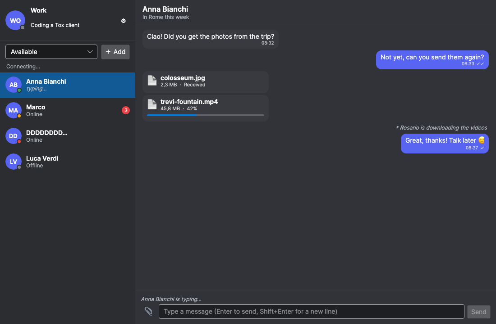
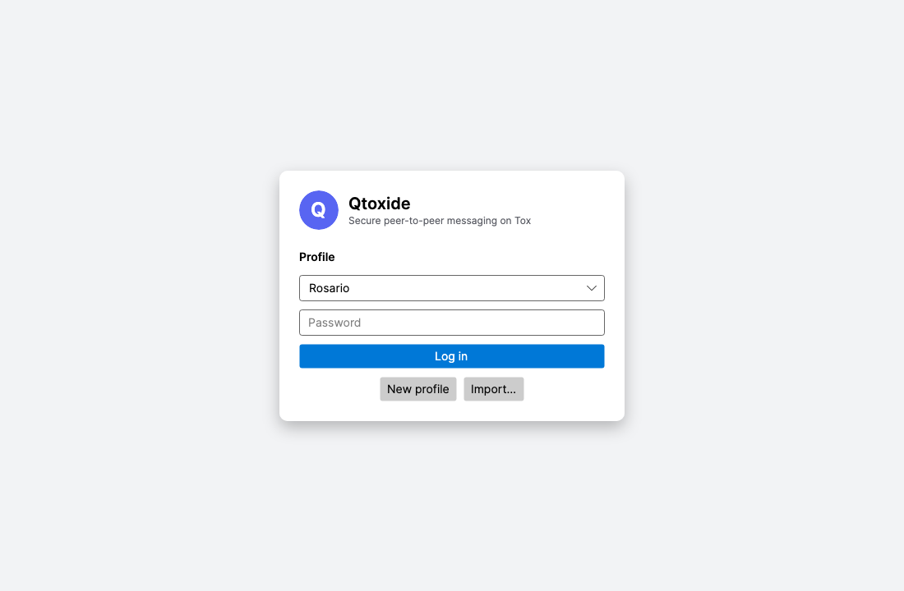
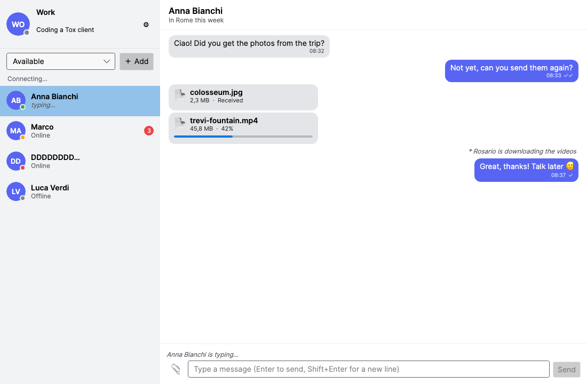
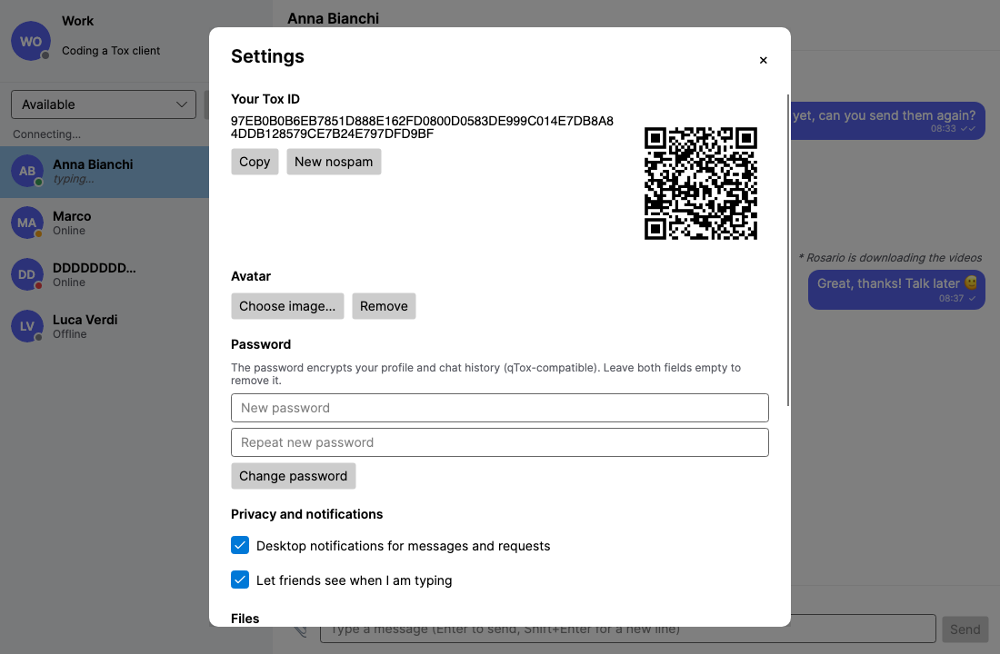

# Qtoxide

A desktop [Tox](https://tox.chat) messenger in the spirit of qTox, written in C# with
[Avalonia](https://avaloniaui.net) on top of [Toxide](https://www.nuget.org/packages/Toxide), a managed implementation of the
Tox protocol. Runs on Windows, macOS and Linux and talks to qTox, uTox, Toxic and every other
toxcore-based client.



<p align="center">
  
  
  
</p>

## Features

- **Profiles**: create several, protect them with a password (profile *and* chat history are
  encrypted), import `.tox` files from qTox and other clients, export them back.
- **Friends**: add by Tox ID (also `tox:` links), accept or decline requests, presence
  (online / away / busy), status messages, typing indicators, unread counters.
- **Chat**: persistent history, read receipts (✓ sent, ✓✓ delivered), `/me` actions, long messages
  split automatically, messages to offline friends queued and delivered when they come back.
- **Files**: send and receive with progress, pause/resume and cancel; avatars exchanged like qTox
  (PNG, at most 64 KiB, deduplicated by hash).
- **Settings**: name, status, avatar, Tox ID with QR code, new nospam, password change, desktop
  notifications, download folder, LAN discovery, IPv6, extra bootstrap nodes.

Not yet: audio/video calls, group chats, TCP relays (friends must be reachable over UDP,
possibly after NAT hole punching) — these depend on Toxide.

## Build and run

Requires the .NET 8 SDK. Toxide comes from NuGet ([Toxide](https://www.nuget.org/packages/Toxide)).

```bash
dotnet run --project src/Qtoxide
```

Data lives in `%LOCALAPPDATA%\Qtoxide`, `~/Library/Application Support/Qtoxide` or
`~/.local/share/Qtoxide` (set `QTOXIDE_HOME` to use another folder, e.g. a portable install).
Each profile is a qTox-compatible `profiles/<name>.tox` file, with `<name>.history`,
`<name>.settings.json` and `<name>.avatars/` next to it.

## Tests

```bash
dotnet test
```

- service tests (profiles, passwords, history encryption, imports, message splitting);
- an end-to-end test: two clients and relay nodes over real UDP on localhost, going through friend
  request, chat, receipts, `/me`, file transfer, avatar and offline message delivery;
- headless rendering of every screen in light and dark theme, saved to `screenshots/` (the images in
  `docs/screenshots/` come from there).

## License

GPL-3.0-or-later, like Toxide and toxcore.
